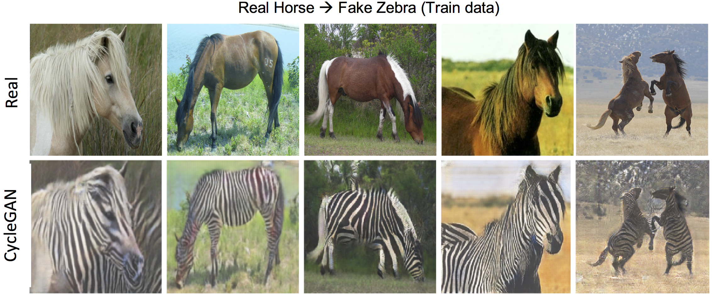
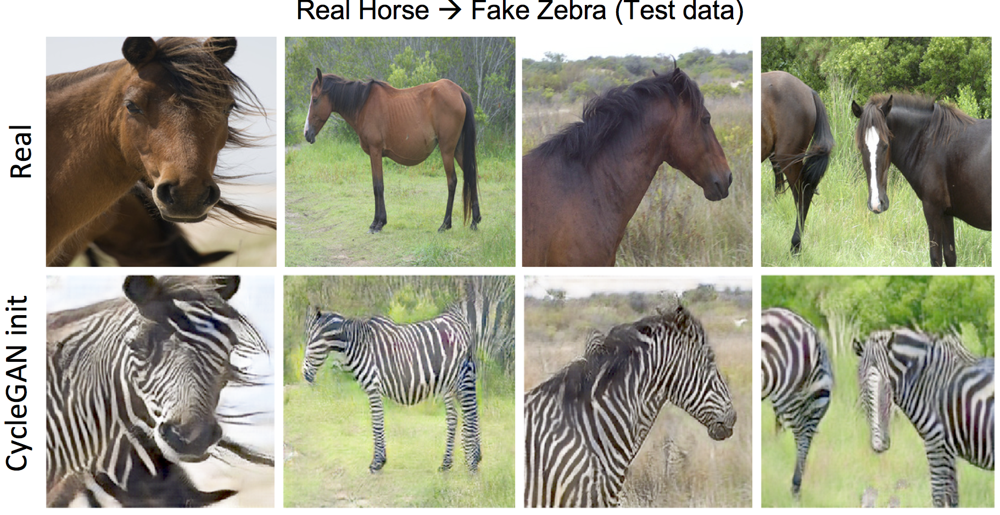
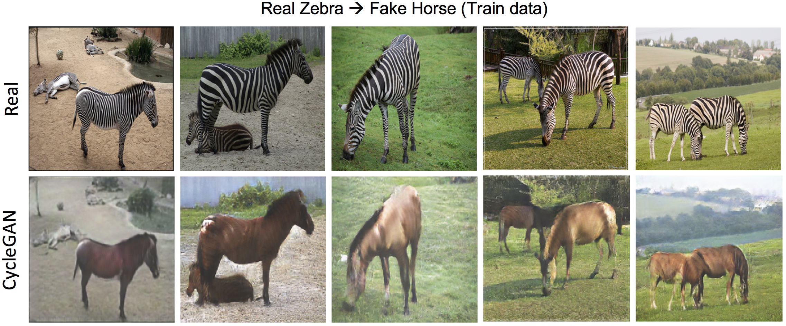
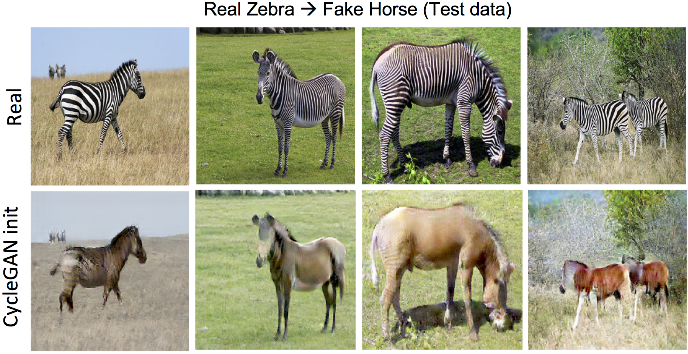

# CycleGAN
Re-implementation of the CycleGAN model proposed by Zhu et al. (See it [here](http://openaccess.thecvf.com/content_iccv_2017/html/Zhu_Unpaired_Image-To-Image_Translation_ICCV_2017_paper.html)). CycleGAN is a deep learning model for image-to-image translation in the absence of paired training data. In particular, CycleGAN learns mappings between two domains even if no supervision is available on these mappings. To this end, CycleGAN simultaneously trains and maintains four deep neural networks. Also, a new version of CycleGAN (in /CycleGAN-Sync folder) was developed that can train the model using synchronous distributed training on multiple GPUs

## Applications
I used this model for object transfiguration (horse <-> zebra), artistic style transfer (Monet & Cezzane painting <-> real photo), and season transfer (summer <-> winter). Here are some of the results:

### Horse <-> Zebra

### Painitng <-> Photo

